# 🚀 Jenkins CI/CD Pipeline with Ansible and Docker for PHP Project  

## 📌 1. Project Overview  
This project demonstrates a fully automated CI/CD pipeline using Jenkins, Ansible, and Docker to deploy a PHP application inside a Docker container on a Jenkins slave node. 

✨ Key Features:  
- 🐧 Automated **Docker installation** with Ansible  
- 📦 Build Docker images for a **PHP application**  
- 🚢 Deploy the application container on Jenkins Slave  
- 🧹 Automatic cleanup on failures  

---

## ⚙️ 2. Environment Setup  
- **Jenkins Master-Slave Architecture**:  
  - 🖥️ The Jenkins Master-Slave architecture allows distributing build workloads. Here, the 
Jenkins master controls builds, and the slave node executes jobs, providing a clean, 
isolated environment.
- The final PHP application runs inside a Docker container on port 8080 on the Jenkins slave node. 

📸 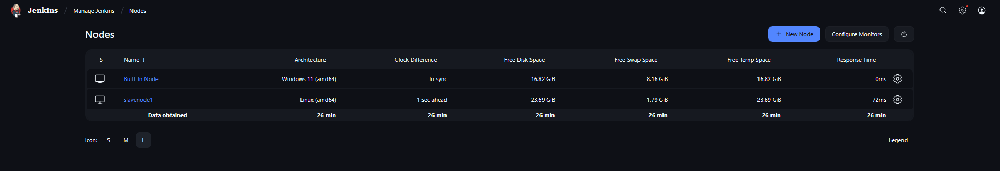

---

## 📜 3. Ansible Playbook Creation  
Ansible playbook install_docker.yml automates Docker installation with these tasks: 
- 🔄 Updates package cache  
- 📥 Installs dependencies  
- 🔑 Adds Docker repo & GPG key  
- 🐳 Installs **Docker Engine**  
- ✅ Enables Docker service  

📸 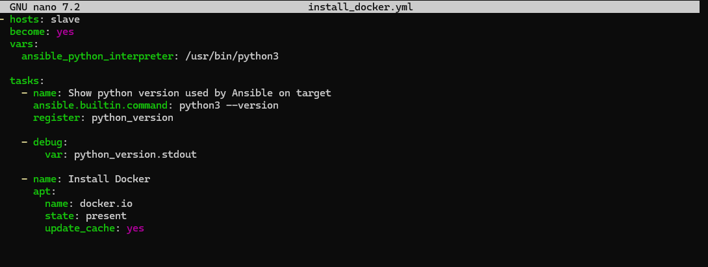  

---

## 🛠️ 4. Jenkins Job 1: Install_Docker_Ansible  
- Runs the Ansible playbook on the slave node to install Docker.  
- Configured Git repo / playbook path  
- Enabled **Poll SCM** for auto-trigger  
- Executes:  
  
  ansible-playbook install_docker.yml

📸 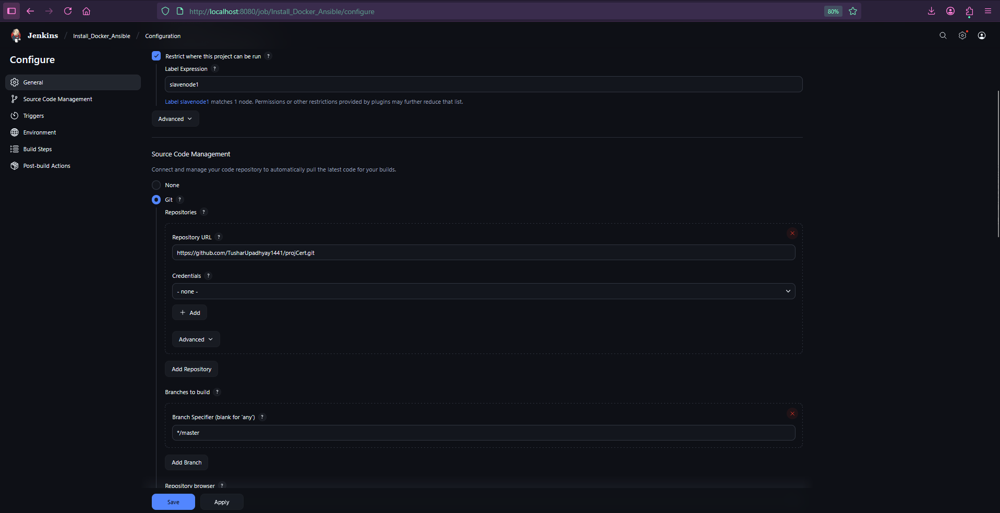
    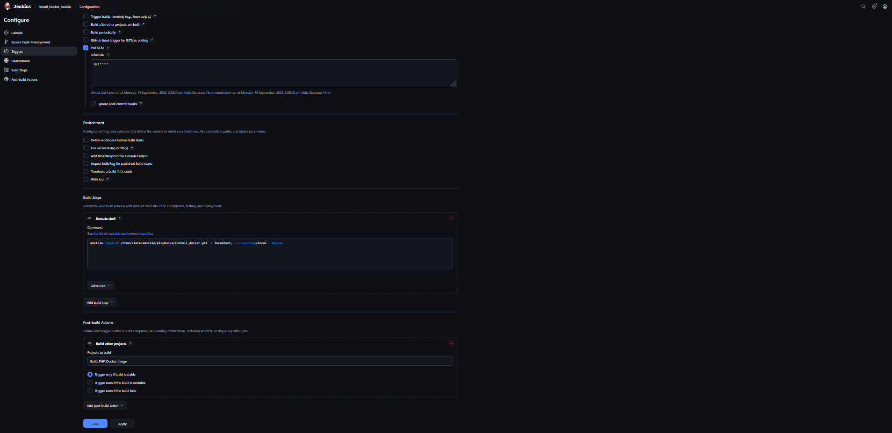
    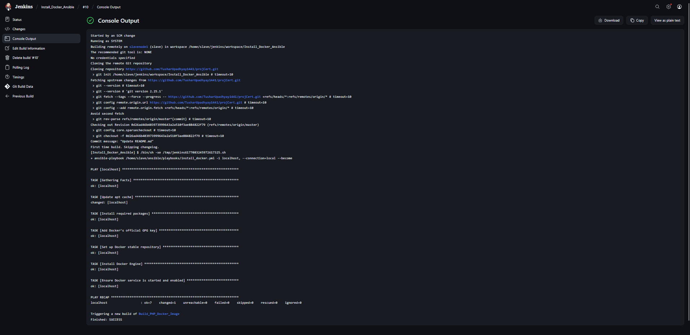
---

## 🏗️ 5. Jenkins Job 2: Build_PHP_Docker_Image
- Clones the PHP project from GitHub
- Builds the Docker image:
    
  - docker build -t my-php-app .

📸 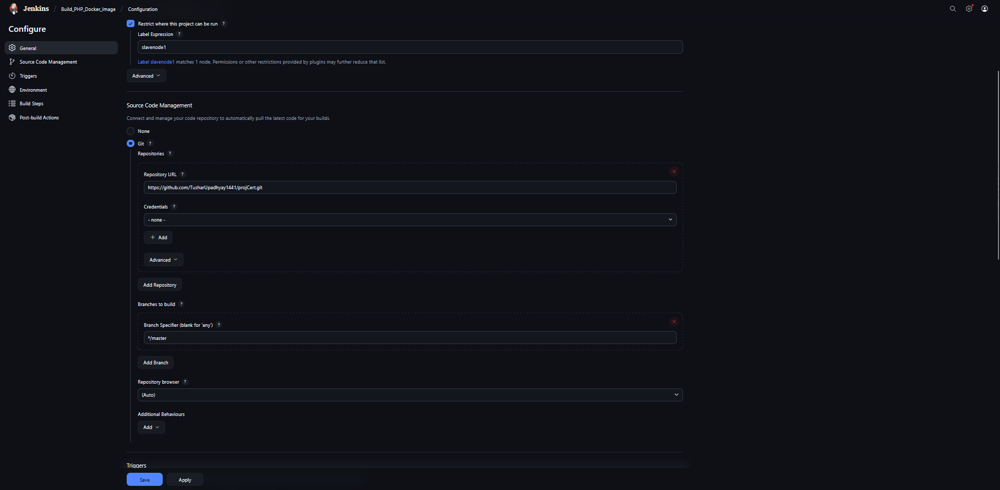
    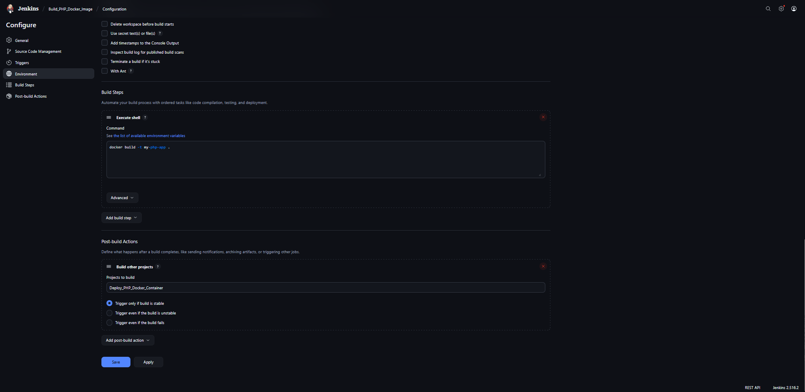
    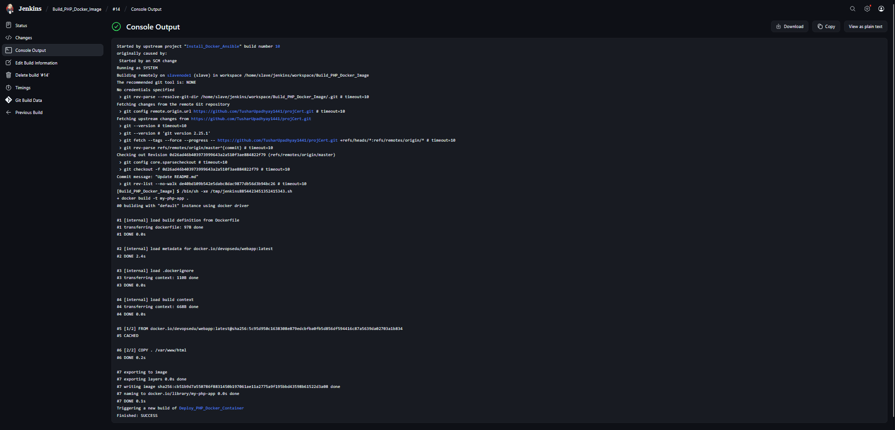

---

## 🚀 6. Jenkins Job 3: Deploy_PHP_Docker_Container
Deploys the PHP container:
    
    "docker stop my-php-app || true"
    "docker rm my-php-app || true"
    "docker run -d --name my-php-app -p 8080:80 my-php-app"

📸 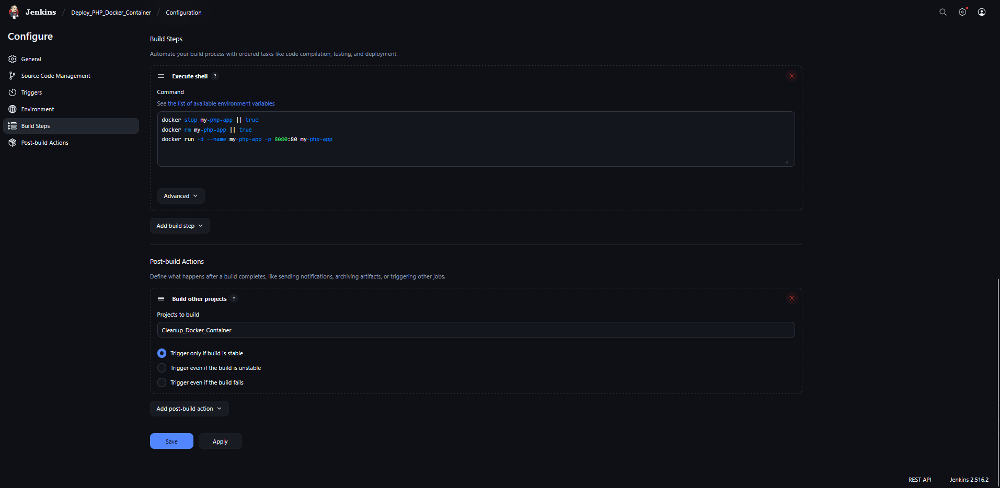
    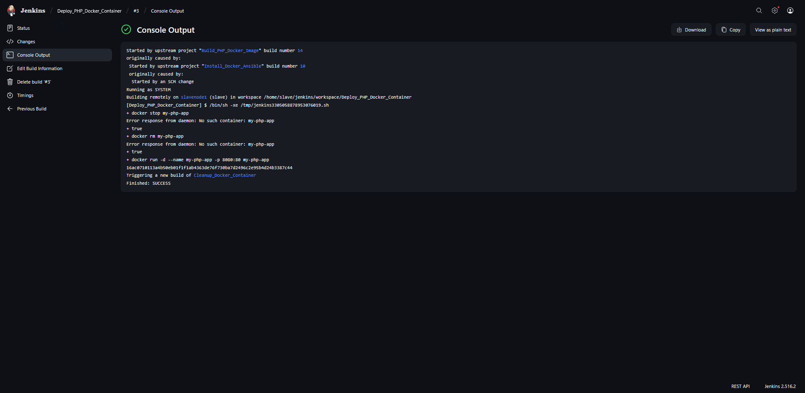

---

## 🧹 7. Jenkins Job 4: Cleanup_Docker_Container
Stops and removes failed containers to keep the environment clean and stable.

📸 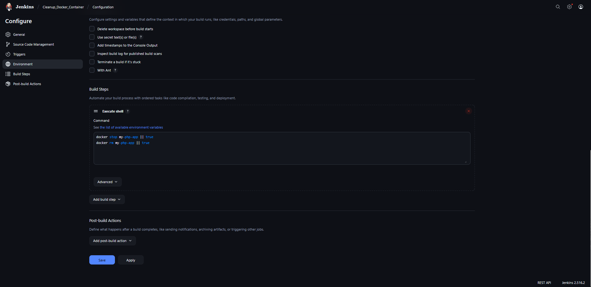
    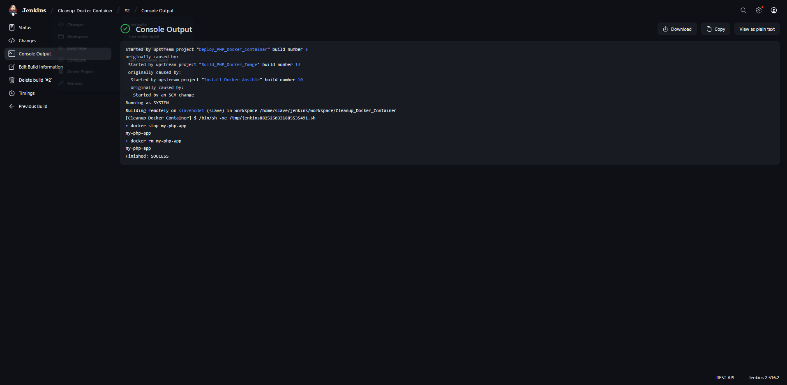

---

## 🔗 8. Job Chaining & Pipeline Flow
✅ Job 1 → triggers Job 2 (on success)
✅ Job 2 → triggers Job 3 (on success)
⚠️ Job 3 → triggers Job 4 (on failure)

📸 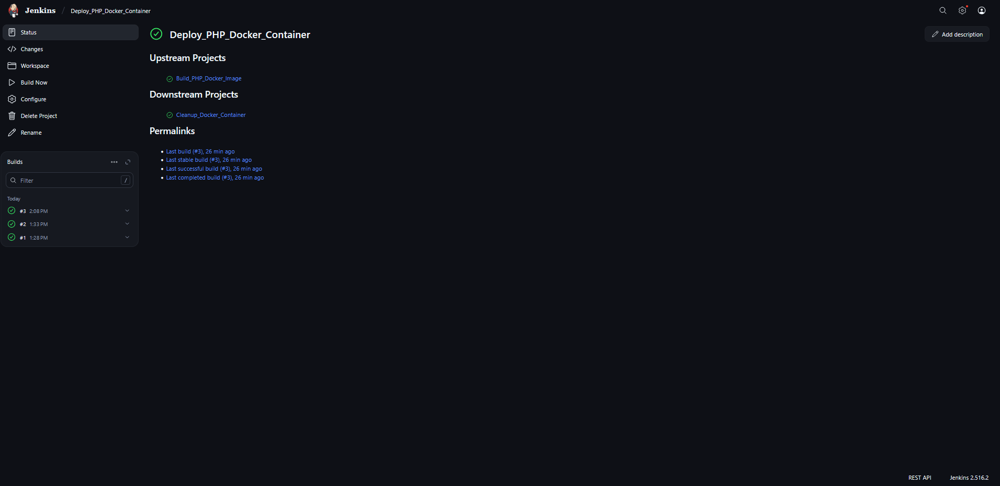

---

## ⏱️ 9. Triggering Mechanism (Poll SCM)
Jenkins polls GitHub every minute to automatically trigger the full pipeline on new commits:
    
    - H/1 * * * *
New commits trigger Job 1 → full pipeline automatically

📸 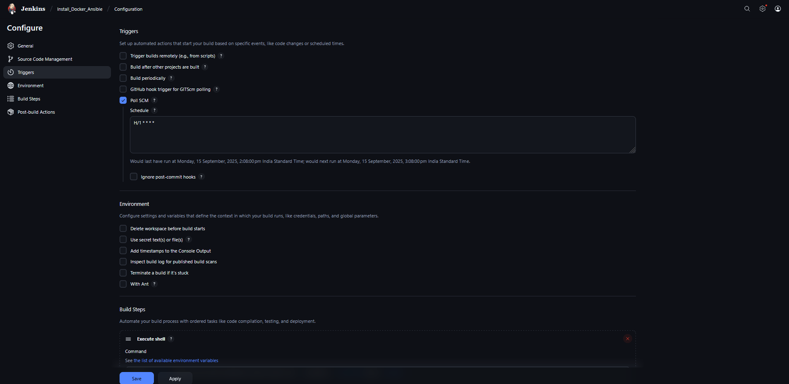

---

## ▶️ 10. Running the Pipeline
Push code to GitHub
Jenkins auto-triggers pipeline
Jenkins auto-triggers the pipeline jobs sequentially (Install → Build → Deploy → Cleanup)
🎉 Final Output → PHP app running in Docker container (http://slave-node:8080)

📸 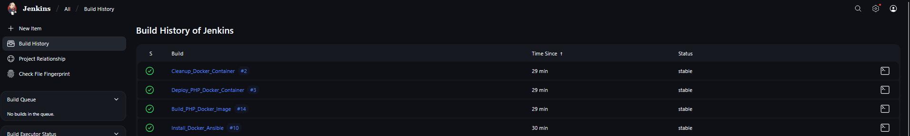

---

## 🛠️ 11. Troubleshooting & Fixes
🔑 SSH key issues → accepted manually
🔓 Sudo password prompts → fixed with passwordless sudo
🔒 Apt lock conflicts → resolved by killing processes & removing locks

---

## ✅ Conclusion

This project integrates Jenkins, Ansible, and Docker for fully automated CI/CD deployment, enabling reliable and consistent application delivery with minimal manual effort.

---

## 🧰 Technologies Used

🐳 Docker
⚙️ Jenkins
📜 Ansible
🐘 PHP
🌐 Git/GitHub

---

## 📊 Pipeline Diagram
    
    [ GitHub Commit ] 
        |
        v
    [ Job 1: Install_Docker_Ansible ]
        |
        v
    [ Job 2: Build_PHP_Docker_Image ]
        |
        v
    [ Job 3: Deploy_PHP_Docker_Container ]
        |
   (on failure)
        v
    [ Job 4: Cleanup_Docker_Container ]
